# BrainStormX Architecture

This document provides a comprehensive overview of the BrainStormX system architecture, showing the relationships between all major components and data flows.

## System Architecture Diagram

```mermaid
graph TB
    %% Styling definitions
    classDef presentationLayer fill:#E3F2FD,stroke:#90CAF9,stroke-width:2px
    classDef applicationLayer fill:#FFFFFF,stroke:#0047AB,stroke-width:2px
    classDef securityLayer fill:#B2EBF2,stroke:#26C6DA,stroke-width:2px
    classDef flaskServer fill:#F3E5F5,stroke:#CE93D8,stroke-width:2px
    classDef assistantLayer fill:#D1C4E9,stroke:#9575CD,stroke-width:2px
    classDef documentProcessing fill:#E1BEE7,stroke:#BA68C8,stroke-width:2px
    classDef realTimeLayer fill:#FFE0B2,stroke:#FFB74D,stroke-width:2px
    classDef aiService fill:#B3E5FC,stroke:#64B5F6,stroke-width:2px
    classDef mcpServers fill:#CFD8DC,stroke:#90A4AE,stroke-width:2px
    classDef coreBusinessLogic fill:#DCEDC8,stroke:#81C784,stroke-width:2px
    classDef mediaAdapters fill:#B2DFDB,stroke:#26A69A,stroke-width:2px
    classDef dataLayer fill:#FFCDD2,stroke:#E57373,stroke-width:2px
    classDef externalProviders fill:#FFECB3,stroke:#FFB300,stroke-width:2px
    classDef aiModels fill:#FFF9C4,stroke:#FFF176,stroke-width:2px
    classDef localServices fill:#E8F5E9,stroke:#A5D6A7,stroke-width:2px

    %% Presentation Layer
    subgraph PL[" "]
        direction TB
        WB[Web Browser<br/>HTML/CSS/JS]
        WSC[WebSocket Client<br/>Real-Time UI]
        WRC[WebRTC Client<br/>Peer-to-Peer Video]
    end

    %% Application Layer Container
    subgraph AL[" "]
        direction TB
        
        %% Security Layer
        subgraph SL[" "]
            direction LR
            LB[Load Balancer]
            SSL[SSL/TLS Termination]
            CSRF[CSRF Protection]
            CORS[CORS Policy]
        end

        %% Flask Server
        subgraph FS[" "]
            direction LR
            AUTH[Auth Blueprint<br/>Login/Register/Reset]
            WORKSHOP[Workshop Blueprint<br/>Lifecycle Management]
            MAIN[Main Blueprint<br/>Jinja Frontend Template]
            ACCOUNT[Account Blueprint<br/>Profile management]
            DOCUMENT[Document Blueprint<br/>Upload/Process/Manage]
            SERVICE[Service Blueprint<br/>AI/ML routes]
        end

        %% Real-time Layer
        subgraph RTL[" "]
            direction LR
            SOCKETIO[Flask-SocketIO<br/>Eventlet/Threading]
            WEBRTC[Video Streaming<br/>WebRTC Gateway]
            TRANSCRIPT[Transcription Gateway<br/>STT Stream]
            VOTING[Voting Gateway]
            NAMESPACE[Assistant / Chat / Room<br/>Streaming Namespaces]
            TTSSTREAM[TTS Audio Streaming Gateway]
        end

        %% Assistant Layer
        subgraph ASL[" "]
            direction LR
            CONTROLLER[Assistant Controller<br/>Planner/Orchestrator]
            PERSONA[Persona Router<br/>Guide/Scribe/Mediator]
            CONTEXT[Context Fabric<br/>State Awareness]
            MEMORY[Memory Gateway]
            MCP[MCP Gateway]
            TOOLING[Tooling/Skills]
            KNOWLEDGE[Knowledge Base]
        end

        %% Document Processing
        subgraph DP[" "]
            direction LR
            QUEUE[Process Queue<br/>Background Jobs]
            EMBEDDER[Local Embedder<br/>Sentence Transformer]
            EXTRACT[Text Extraction<br/>PDF/DOCX/PPTX]
            IMAGE[Image Extractor<br/>Titan Embed Image]
            CHUNKER[Content Chunker<br/>Semantic Splitting]
            SUMMARIZER[Summary Generator<br/>Nova Lite]
        end

        %% AI Service (SOA)
        subgraph AIS[" "]
            direction LR
            BRIEFING[Briefing Agent<br/>Workshop Framer]
            WARMUP[Warm-up Agent<br/>Icebreaking Coach]
            IDEATION[Ideation Agent<br/>Brainstorming Coach]
            CLUSTERING[Clustering/Voting<br/>Agent]
            PRIORITIZER[Prioritizer Agent<br/>Impact/Effort/Matrix]
            FEASIBILITY[Feasibility Analyzer<br/>Risk Assessor]
            SUMMARIZE[Summarizer<br/>Presentation Agent]
            PLANNER[Action Planner<br/>Milestones/Task]
            AGENDA[Agenda Creator<br/>LLM/RAG Generation]
            ICEBREAKER[Icebreaker/Tips<br/>Agent]
            PHOTO[Photo Editor<br/>Enhancement Agent]
            DISCUSSION[Discussion Agent<br/>Mediator/Devil Advocate]
        end

        %% MCP Servers
        subgraph MCPS[" "]
            direction LR
            DBMCP[Database MCP<br/>SQL Agent]
            DOCMCP[Document MCP<br/>list/summarize]
            WORKSHOPMCP[Workshop MCP<br/>controls/actions]
        end

        %% Core Business Logic
        subgraph CBL[" "]
            direction LR
            ADVANCER[Workshop Advancer<br/>Phase Navigation]
            REGISTRY[Task Registry]
            PLAN[Session Plan]
        end

        %% Media Adapters
        subgraph MA[" "]
            direction LR
            STTFACTORY[STT Factory<br/>Vosk/ AWS Transcribe]
            TTSFACTORY[TTS Factory<br/>Piper/ Optional Polly]
            PDFFACTORY[PDF Factory<br/>Report Generator]
            PPTXFACTORY[PPTX Factory<br/>Presentation Generator]
        end
    end

    %% Data Layer
    subgraph DL[" "]
        direction LR
        SQLITE[SQLite Database<br/>Core Application Data]
        VECTOR[Vector Database<br/>Document Embeddings]
        FILES[File Storage<br/>Uploads/Media/Reports]
    end

    %% External Providers
    subgraph EP[" "]
        direction LR
        BEDROCK[AWS Bedrock<br/>Foundation Models]
        AGENTCORE[AWS Bedrock<br/>AgentCore Memory]
        POLLY[AWS Polly<br/>Optional TTS]
        TRANSCRIBE[AWS Transcribe<br/>Optional STT]
        TURN[TURN /STUN<br/>coTurn Server]
        TITAN[AWS Titan<br/>Embeddings Models]
    end

    %% Local Services
    subgraph LS[" "]
        direction LR
        PIPER[Piper TTS<br/>Local Engine]
        VOSK[Vosk STT<br/>Local Engine]
        NGINX[Nginx<br/>Reverse Proxy]
    end

    %% Connections - Presentation to Application
    WB --> SL
    WSC --> SOCKETIO
    WRC --> WEBRTC

    %% Security to Flask Server
    SL --> MAIN

    %% Flask Server Internal Connections
    SERVICE --> ASL
    DOCUMENT --> DP
    WORKSHOP --> SOCKETIO
    WORKSHOP --> IDEATION
    WORKSHOP --> CBL

    %% Assistant Layer Internal
    TOOLING --> AIS
    PERSONA --> DISCUSSION
    MCP --> MCPS

    %% Real-time Layer Internal
    SOCKETIO --> WEBRTC
    SOCKETIO --> TRANSCRIPT
    SOCKETIO --> VOTING
    SOCKETIO --> NAMESPACE
    SOCKETIO --> TTSSTREAM

    %% Service to AI Services
    SERVICE --> BRIEFING
    SERVICE --> WARMUP
    SERVICE --> CLUSTERING
    SERVICE --> AIS

    %% AI Services to Media Adapters
    BRIEFING --> PDFFACTORY
    FEASIBILITY --> PDFFACTORY
    PLANNER --> PDFFACTORY
    SUMMARIZE --> PPTXFACTORY

    %% MCP Servers to Services
    DBMCP --> DOCUMENT
    DOCMCP --> DOCUMENT
    WORKSHOPMCP --> CLUSTERING
    WORKSHOPMCP --> DISCUSSION
    WORKSHOPMCP --> IDEATION

    %% Core Business Logic
    CONTEXT --> CBL
    WORKSHOP --> CBL

    %% Document Processing to AI
    PHOTO --> DOCUMENT

    %% Media Adapters to External/Local
    TTSFACTORY --> PIPER
    TTSFACTORY --> POLLY
    STTFACTORY --> VOSK
    STTFACTORY --> TRANSCRIBE
    TRANSCRIPT --> STTFACTORY

    %% External Services
    ASL --> BEDROCK
    MEMORY --> AGENTCORE
    DP --> TITAN
    IMAGE --> TITAN
    WRC --> TURN

    %% Data Layer Connections
    FS --> SQLITE
    DP --> VECTOR
    MA --> FILES

    %% Apply styling
    class PL presentationLayer
    class AL applicationLayer
    class SL securityLayer
    class FS flaskServer
    class RTL realTimeLayer
    class ASL assistantLayer
    class DP documentProcessing
    class AIS aiService
    class MCPS mcpServers
    class CBL coreBusinessLogic
    class MA mediaAdapters
    class DL dataLayer
    class EP externalProviders
    class LS localServices

    %% Individual component styling
    class WB,WSC,WRC presentationLayer
    class LB,SSL,CSRF,CORS securityLayer
    class AUTH,WORKSHOP,MAIN,ACCOUNT,DOCUMENT,SERVICE flaskServer
    class SOCKETIO,WEBRTC,TRANSCRIPT,VOTING,NAMESPACE,TTSSTREAM realTimeLayer
    class CONTROLLER,PERSONA,CONTEXT,MEMORY,MCP,TOOLING,KNOWLEDGE assistantLayer
    class QUEUE,EMBEDDER,EXTRACT,IMAGE,CHUNKER,SUMMARIZER documentProcessing
    class BRIEFING,WARMUP,IDEATION,CLUSTERING,PRIORITIZER,FEASIBILITY,SUMMARIZE,PLANNER,AGENDA,ICEBREAKER,PHOTO,DISCUSSION aiService
    class DBMCP,DOCMCP,WORKSHOPMCP mcpServers
    class ADVANCER,REGISTRY,PLAN coreBusinessLogic
    class STTFACTORY,TTSFACTORY,PDFFACTORY,PPTXFACTORY mediaAdapters
    class SQLITE,VECTOR,FILES dataLayer
    class BEDROCK,AGENTCORE,POLLY,TRANSCRIBE,TURN,TITAN externalProviders
    class PIPER,VOSK,NGINX localServices
```

## Architecture Overview

### Layer Descriptions

#### **Presentation Layer**
- **Web Browser**: HTML/CSS/JavaScript frontend interface
- **WebSocket Client**: Real-time UI updates and interactions
- **WebRTC Client**: Peer-to-peer video communication

#### **Application Layer**

##### **Security Layer**
- **Load Balancer**: Distributes incoming requests
- **SSL/TLS Termination**: Handles encrypted connections
- **CSRF Protection**: Prevents cross-site request forgery attacks
- **CORS Policy**: Manages cross-origin resource sharing

##### **Flask Server** (Python/Flask Blueprints)
- **Auth Blueprint**: User authentication, login, registration, password reset
- **Workshop Blueprint**: Workshop lifecycle management and coordination
- **Main Blueprint**: Primary frontend template rendering (Jinja2)
- **Account Blueprint**: User profile and account management
- **Document Blueprint**: File upload, processing, and management
- **Service Blueprint**: AI/ML service routes and endpoints

##### **Real-time Layer**
- **Flask-SocketIO**: WebSocket server with Eventlet/Threading support
- **Video Streaming**: WebRTC gateway for peer-to-peer video
- **Transcription Gateway**: Real-time speech-to-text streaming
- **Voting Gateway**: Live voting and polling mechanisms
- **Namespace Management**: Organized real-time communication channels
- **TTS Audio Streaming**: Text-to-speech audio delivery

##### **Assistant Layer** (AI Orchestration)
- **Assistant Controller**: Central planner and orchestrator
- **Persona Router**: Manages different AI personas (Guide/Scribe/Mediator)
- **Context Fabric**: Maintains state awareness across sessions
- **Memory Gateway**: Interface to persistent memory systems
- **MCP Gateway**: Model Context Protocol integration
- **Tooling/Skills**: Available AI tools and capabilities
- **Knowledge Base**: Structured information repository

##### **Document Processing** (Background Processing)
- **Process Queue**: Asynchronous job management
- **Local Embedder**: Sentence transformer for text embeddings
- **Text Extraction**: Handles PDF, DOCX, PPTX content extraction
- **Image Extractor**: Uses Titan Embed Image for visual content
- **Content Chunker**: Semantic text splitting and organization
- **Summary Generator**: Uses Nova Lite for content summarization

##### **AI Service (SOA)** (Specialized AI Agents)
- **Briefing Agent**: Workshop context and framing
- **Warm-up Agent**: Icebreaking and engagement activities
- **Ideation Agent**: Brainstorming facilitation and coaching
- **Clustering/Voting Agent**: Idea organization and decision making
- **Prioritizer Agent**: Impact/effort matrix analysis
- **Feasibility Analyzer**: Risk assessment and viability analysis
- **Summarizer**: Presentation and report generation
- **Action Planner**: Milestone and task planning
- **Agenda Creator**: LLM/RAG-powered agenda generation
- **Icebreaker/Tips Agent**: Activity suggestions and guidance
- **Photo Editor**: Image enhancement capabilities
- **Discussion Agent**: Mediation and devil's advocate functions

##### **MCP Servers** (Model Context Protocol)
- **Database MCP**: SQL agent for database operations
- **Document MCP**: Document listing and summarization
- **Workshop MCP**: Workshop controls and actions

##### **Core Business Logic**
- **Workshop Advancer**: Phase navigation and progression
- **Task Registry**: Available workshop tasks and activities
- **Session Plan**: Workshop structure and timing

##### **Media Adapters** (Factory Pattern)
- **STT Factory**: Speech-to-text (Vosk/AWS Transcribe)
- **TTS Factory**: Text-to-speech (Piper/AWS Polly)
- **PDF Factory**: Report generation
- **PPTX Factory**: Presentation generation

#### **Data Layer**
- **SQLite Database**: Core application data persistence
- **Vector Database**: Document embeddings and semantic search
- **File Storage**: Uploads, media files, and generated reports

#### **External Providers** (Cloud Services)
- **AWS Bedrock**: Foundation models (Nova family)
- **AWS Bedrock AgentCore**: Memory and context management
- **AWS Polly**: Optional cloud text-to-speech
- **AWS Transcribe**: Optional cloud speech-to-text
- **TURN/STUN Server**: WebRTC connection facilitation
- **AWS Titan**: Embedding models for text and images

#### **Local Services** (Self-hosted)
- **Piper TTS**: Local text-to-speech engine
- **Vosk STT**: Local speech-to-text engine
- **Nginx**: Reverse proxy and load balancer

## Data Flow

### Primary Workshop Flow
1. **User Authentication** → Auth Blueprint → Security Layer
2. **Workshop Creation** → Workshop Blueprint → Core Business Logic
3. **Document Upload** → Document Blueprint → Document Processing → Vector Database
4. **AI Assistant Interaction** → Service Blueprint → Assistant Layer → AI Services
5. **Real-time Collaboration** → WebSocket Client → Flask-SocketIO → Various Gateways
6. **Video Communication** → WebRTC Client → Video Streaming Gateway
7. **Report Generation** → AI Services → Media Adapters → File Storage

### AI Processing Pipeline
1. **User Input** → Assistant Controller → Persona Router
2. **Context Retrieval** → Context Fabric → Memory Gateway → AgentCore
3. **Tool Selection** → Tooling/Skills → MCP Gateway → MCP Servers
4. **AI Processing** → Specialized Agents → AWS Bedrock Models
5. **Response Generation** → Media Adapters → Client Delivery

### Document Processing Pipeline
1. **Upload** → Document Blueprint → Process Queue
2. **Text Extraction** → Content Chunker → Local Embedder
3. **Image Processing** → Image Extractor → Titan Embed Image
4. **Storage** → Vector Database + File Storage
5. **Summary Generation** → Summary Generator → Nova Lite

## Technology Stack

### Backend
- **Python 3.11+** with Flask framework
- **Flask-SocketIO** for real-time communication
- **SQLite** for relational data
- **Vector database** for embeddings (implementation-specific)
- **Gunicorn** with Eventlet workers for production deployment

### Frontend
- **HTML5/CSS3/JavaScript** with modern web standards
- **WebSocket API** for real-time features
- **WebRTC API** for peer-to-peer video
- **Responsive design** for multi-device support

### AI/ML
- **AWS Bedrock** with Nova model family
- **Local sentence transformers** for embeddings
- **Piper TTS** for local text-to-speech
- **Vosk** for local speech-to-text

### Infrastructure
- **Nginx** reverse proxy
- **SSL/TLS** encryption
- **Ubuntu 24.04 LTS** deployment target
- **Docker** containerization support

## Security Considerations

- **Multi-layer security** with dedicated security layer
- **SSL/TLS termination** at the edge
- **CSRF protection** for state-changing operations
- **CORS policies** for cross-origin requests
- **Authentication and authorization** throughout the stack
- **Input validation** and sanitization
- **Secure file upload** and processing

## Scalability Features

- **Microservice-oriented architecture** with clear separation of concerns
- **Asynchronous processing** with background job queues
- **Real-time communication** with efficient WebSocket management
- **Load balancing** capabilities
- **Stateless design** for horizontal scaling
- **Local processing** options to reduce external dependencies

## Development Principles

- **Separation of Concerns**: Clear layer boundaries and responsibilities
- **Factory Pattern**: Consistent interfaces for media processing
- **Service-Oriented Architecture**: Modular AI services
- **Event-Driven**: Real-time updates and notifications
- **Plugin Architecture**: Extensible through MCP servers
- **Configuration-Driven**: Environment-specific settings